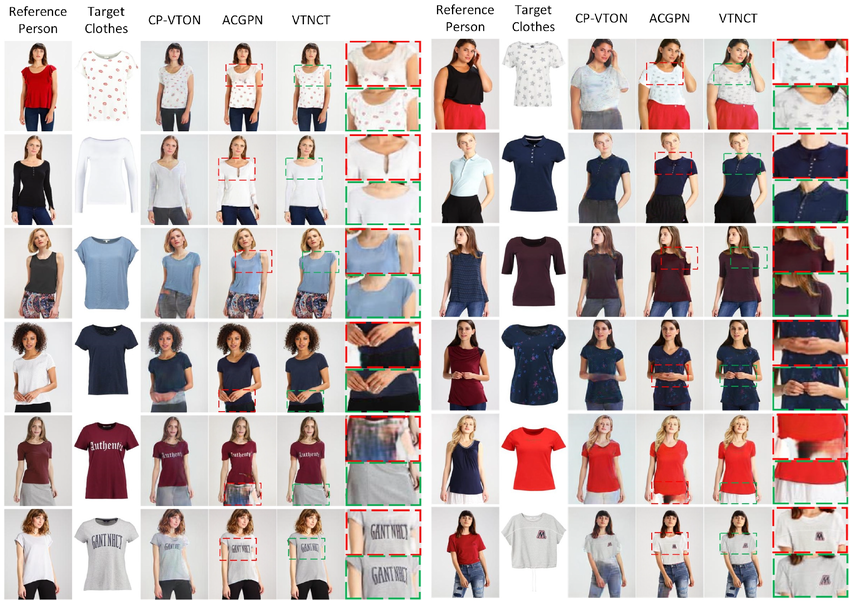
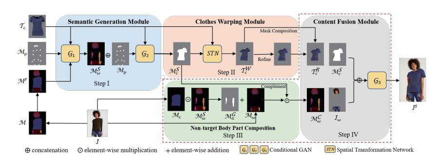

# Virtual Try-On System

[](https://opensource.org/licenses/MIT)  
[](https://www.python.org/)  
[](https://pytorch.org/)  

## Introduction



The **Virtual Try-On System** is an advanced AI-powered solution that enables users to visualize clothing items on themselves digitally. Using **Generative Adversarial Networks (GANs)**, **human parsing**, and **garment warping**, the system processes two images:

1. **Person Image** - An image of a person wearing an outfit.
2. **Garment Image** - An image of a different outfit only.

The system then generates an output image where the person appears to be wearing the new outfit.

This technology is highly relevant for e-commerce, fashion design, and augmented reality (AR) applications, as it enhances customer experience, reduces return rates, and provides scalable solutions for retailers.

---

## Table of Contents

- [Project Scope & Importance](#project-scope--importance)
- [Key Uses & Components](#key-uses--components)
- [System Architecture](#system-architecture)
- [Project Structure](#project-structure)
- [Installation](#installation)
- [Usage](#usage)
  - [Training](#training)
  - [Inference](#inference)
  - [Deployment](#deployment)
- [Component Details](#component-details)
- [Troubleshooting](#troubleshooting)
- [Future Enhancements](#future-enhancements)
- [License](#license)
- [Contact](#contact)

---

## Project Scope & Importance

### Scope
- **End-to-End AI Pipeline** - Covers data preprocessing, model training, inference, and real-time deployment.
- **Advanced Deep Learning Techniques** - Implements **GANs** for image synthesis, **TPS warping** for garment alignment, and **ResNet-based human parsing**.
- **Scalability** - Optimized for **GPU acceleration** and cloud deployment.

### Importance
- **E-Commerce Impact** - Reduces return rates by 30-50% by allowing customers to try clothing virtually.
- **Cost Efficiency** - Eliminates logistical costs of physical try-ons and sample production.
- **Innovation** - Provides a digital platform for **fashion designers** to prototype their outfits virtually.

---

## Key Uses & Components

### Key Applications
- **E-Commerce Platforms** - Integrates with online stores for virtual dressing rooms.
- **Fashion Design Studios** - Enables rapid prototyping of new designs on digital models.
- **Augmented Reality (AR) & Virtual Reality (VR)** - Can be extended to mobile/AR glasses for in-store experiences.

### Core Components
1. **Human Parsing Module** - Segments body regions (skin, hair, clothes) using a **ResNet-based** segmentation model.
2. **Garment Warping Module** - Aligns clothing to body pose using **Thin Plate Spline (TPS) transformation**.
3. **GAN Generator** - A **U-Net architecture** that synthesizes the final try-on image.
4. **PatchGAN Discriminator** - Ensures image realism by evaluating synthetic outputs against real ones.
5. **FastAPI Backend** - Enables real-time image processing and serving through a web API.

---

## System Architecture

The Virtual Try-On system follows a structured workflow:

1. **Image Preprocessing** - Resizes images to 256x256 and normalizes them.
2. **Human Parsing** - A segmentation model isolates body parts to facilitate garment placement.
3. **Garment Warping** - Uses TPS transformations to warp the clothing image based on keypoints.
4. **Image Synthesis** - The **GAN generator** fuses parsed human features and warped garments.
5. **Adversarial Training** - The **PatchGAN discriminator** validates the realism of the generated image.
6. **Post-Processing** - Converts tensors to **RGB images** and applies denormalization.



---

## Project Structure

```bash
TRYON_GAN/
├── model/                   # Neural network definitions
│   ├── generator.py         # U-Net generator
│   ├── discriminator.py     # PatchGAN discriminator
│   ├── parsing.py           # ResNet-based human segmentation
│   └── warping.py           # TPS transformation logic
├── scripts/                 # Deployment and inference scripts
│   ├── deploy.py            # FastAPI server
│   └── inference.py         # CLI for batch processing
├── src/                     # Core logic
│   ├── train.py             # Training loop
│   ├── data_preprocessing.py# Image augmentation and normalization
│   └── evaluation.py        # Evaluation metrics
├── static/                  # Web UI assets
│   ├── index.html           # Frontend interface
│   └── style.css            # Styling
├── uploads/                 # User-uploaded images
├── utils/                   # Helper functions
│   ├── data_loader.py       # PyTorch Dataset class
│   └── visualization.py     # Plot training curves
├── requirements.txt         # Python dependencies
└── README.md                # Project documentation
```

---

## Installation

### Prerequisites
- **Python 3.8+**
- **NVIDIA GPU (CUDA 11.x recommended)**
- **Poetry** (optional for dependency management)

### Steps

```bash
git clone https://github.com/FAbdullah17/TryOn_GAN.git
cd Virtual TryOn System
pip install -r requirements.txt
```

---

## Usage

### Training
```bash
python src/train.py --dataset ./data/train --epochs 50 --batch_size 16
```

### Inference
```bash
python scripts/inference.py --person ./uploads/user.jpg --clothing ./data/garment.png
```

### Deployment
```bash
uvicorn scripts.deploy:app --host 0.0.0.0 --port 8000
```

---

## Troubleshooting

| Issue | Solution |
|--------|----------|
| CUDA Out of Memory | Reduce batch size or enable mixed precision |
| Keypoint Errors | Ensure 20 keypoints are normalized (0-1 range) |
| Slow Inference | Optimize model with TensorRT |
| Blurry Outputs | Increase L1 loss weight in training |

---

## Future Enhancements

1. **Automatic Keypoint Detection** - Integrate **OpenPose** for improved accuracy.
2. **High-Resolution Outputs** - Train on **512x512** images using progressive GANs.
3. **3D Garment Modeling** - Enhance realism with depth-aware warping.
4. **Multi-Garment Try-On** - Allow layering (e.g., shirts over jackets).
5. **Mobile Optimization** - Convert models to **ONNX/TFLite** for mobile deployment.

---

## License

This project is licensed under the MIT License. See [LICENSE](LICENSE) for details.

---

## Contact

For inquiries or collaborations:

- **Email**: contact@virtualtryon.ai
- **GitHub**: [FAbdullah17](https://github.com/FAbdullah17)
- **LinkedIn**: [Your Profile](www.linkedin.com/in/fahad-abdullah-3bb72a270)

🌟 **Support this project by starring the repository!** 🌟

